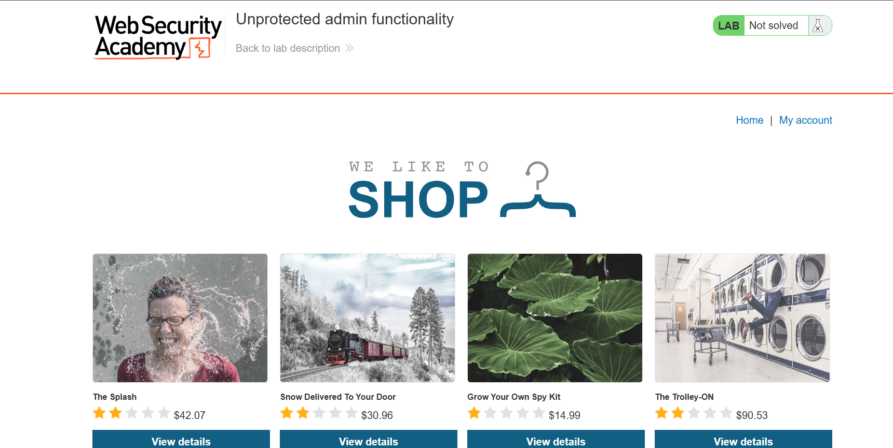
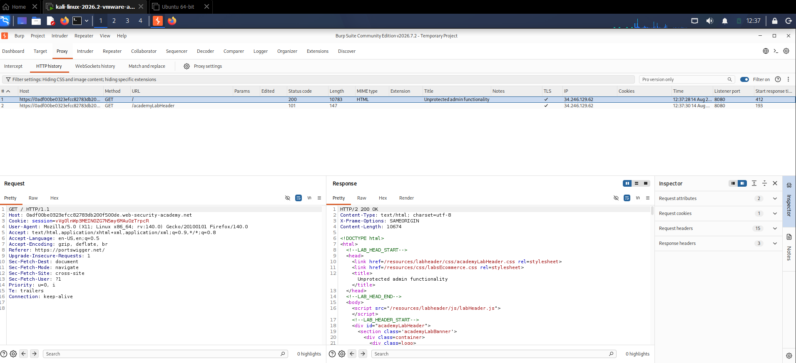
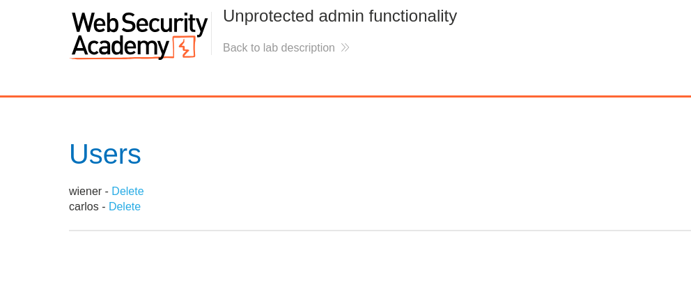
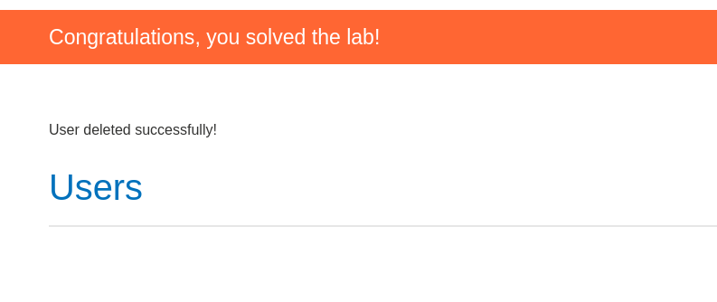
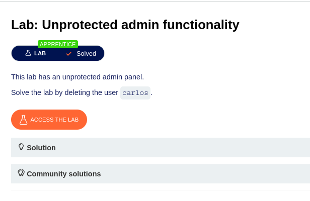

# Lab: Unprotected Admin Functionality

## Objective

Access the hidden admin panel and delete the user `carlos`.

---

## Tools Used

- Burp Suite Community Edition
- Mozilla Firefox
- PortSwigger Web Security Academy

---

## Steps Performed

### Step 1 - Open the Lab

**Description:**

1. Opened the PortSwigger Web Security Academy lab.
2. Explored the homepage.
3. Started Burp Suite and confirmed that HTTP traffic was being intercepted.

**Screenshot:**

---

### Step 2 - Identify the Admin URL

**Description:**

1. Refreshed the homepage while Burp Suite was running.
2. Opened **HTTP History** in Burp Suite.
3. Observed a request for `/academyLabHeader`.
4. Inspected the response and discovered a hidden link pointing to `/admin`.

**Screenshot:**

---

### Step 3 - Access the Admin Panel

**Description:**

1. Copied the hidden endpoint `/admin`.
2. Pasted `/admin` after the lab URL in the browser.
3. Successfully accessed the administrator panel without authentication.

**Screenshot:**

---

### Step 4 - Delete User Carlos

**Description:**

1. Located the user **carlos** in the admin panel.
2. Clicked the **Delete** option.
3. The application removed the user successfully.

**Screenshot:**

---

### Step 5 - Lab Solved

**Description:**

1. After deleting the user **carlos**, the lab displayed the **Solved** status.
2. Verified that the objective was completed successfully.

**Screenshot:**

---

## Vulnerability

The application exposes the administrator interface without enforcing authentication or authorization. Anyone who discovers the hidden URL can directly access privileged functionality.

---

## Impact

- Unauthorized users can access the administrator panel.
- Administrative actions can be performed without logging in.
- Attackers can delete users or modify sensitive application data.
- This can lead to complete compromise of the application.

---

## Mitigation

- Protect all administrative endpoints with server-side authorization.
- Verify user roles before granting access.
- Never rely on hidden URLs as a security mechanism.
- Implement Role-Based Access Control (RBAC).
- Return **403 Forbidden** for unauthorized users.
- Regularly test access controls during security assessments.

---

## Key Learning

- Hidden URLs are **not** a security control.
- Authorization must always be validated on the server.
- Burp Suite HTTP History can reveal hidden application endpoints.
- Unprotected admin functionality is a common Access Control vulnerability.