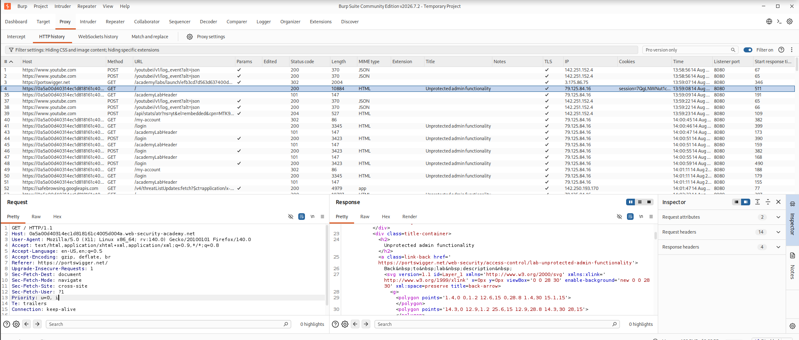

# Lab: Unprotected Admin Functionality with Unpredictable URL

## Objective

Find the hidden administrator URL from the application's JavaScript file and use it to access the admin panel and delete the user `carlos`.

---

## Tools Used

- Burp Suite Community Edition
- Mozilla Firefox
- PortSwigger Web Security Academy

---

## Steps Performed

### Step 1 - Open the Lab

**Description:**

- Opened the PortSwigger Web Security Academy lab.
- Visited the homepage of the vulnerable application.

**Screenshot:**


---

### Step 2 - Inspect HTTP History

**Description:**

- Opened Burp Suite.
- Navigated to **Proxy → HTTP History**.
- Observed the requests generated by the application.

**Screenshot:**



---

### Step 3 - Find the Hidden Admin URL

**Description:**

- Opened the JavaScript source file.
- Found the hidden administrator URL inside the JavaScript code.
- Copied the administrator URL.

Example:

```
/administrator-panel-xxxxx
```

**Screenshot:**


---

### Step 4 - Access the Admin Panel

**Description:**

- Opened the hidden administrator URL in the browser.
- Successfully accessed the administrator panel.

**Screenshot:**


---

### Step 5 - Delete User Carlos

**Description:**

- Located the user **carlos**.
- Clicked the **Delete** button.
- Verified that the user was removed successfully.

**Screenshot:**


---

### Step 6 - Lab Solved

**Description:**

- Verified that the lab displayed the **Solved** message.
- Confirmed the exploit was successful.

**Screenshot:**


---

## Vulnerability

The administrator panel was protected only by an unpredictable URL. However, the URL was exposed in a publicly accessible JavaScript file. Anyone could discover the hidden URL and access the administrator panel without proper authorization.

---

## Impact

- Unauthorized users can discover hidden administrator pages.
- Attackers can access administrative functionality.
- Sensitive actions such as deleting users can be performed.
- This can lead to unauthorized access and compromise of the application.

---

## Root Cause

The application exposed sensitive administrator URLs in client-side JavaScript and did not properly enforce server-side authorization.

---

## Mitigation

- Implement proper server-side authorization checks.
- Never expose sensitive administrator URLs in client-side JavaScript.
- Apply Role-Based Access Control (RBAC).
- Return **403 Forbidden** for unauthorized users.
- Perform regular security testing to identify access control issues.

---

## Key Learning

- Hidden URLs should never be used as a security mechanism.
- JavaScript files are publicly accessible and can reveal sensitive information.
- Always verify authorization on the server.
- Reviewing JavaScript files is an important step during web application security testing.