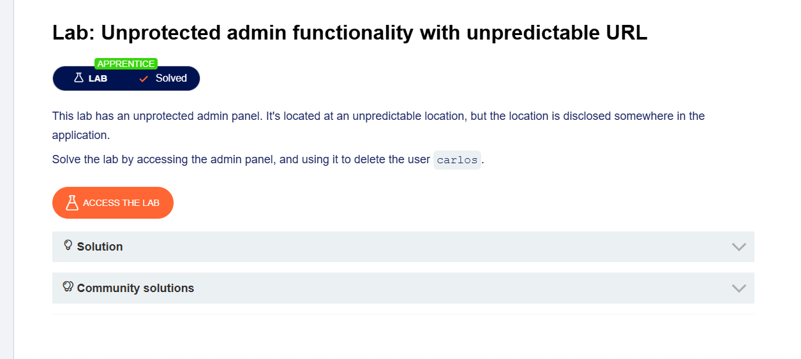
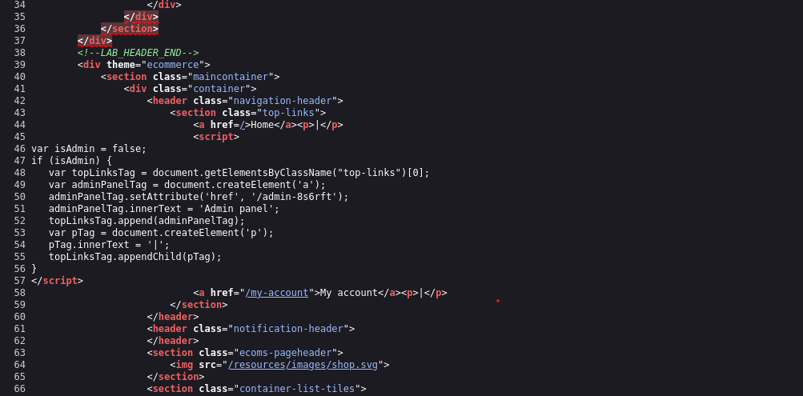
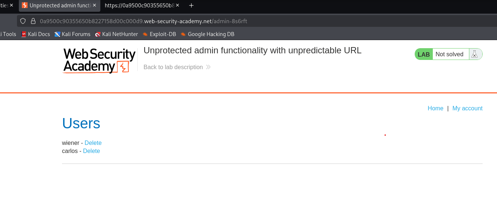
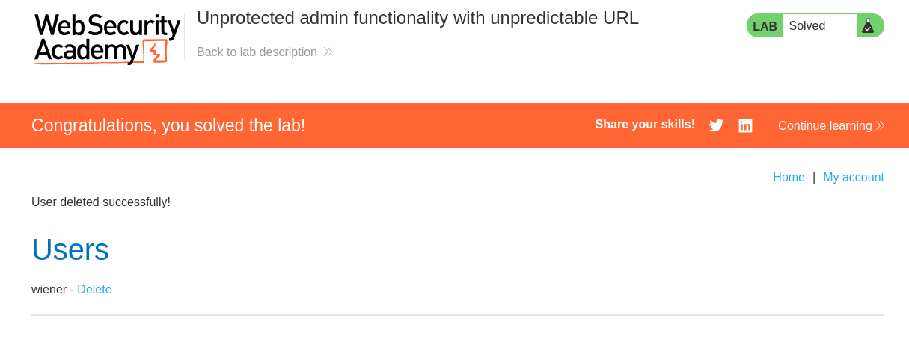
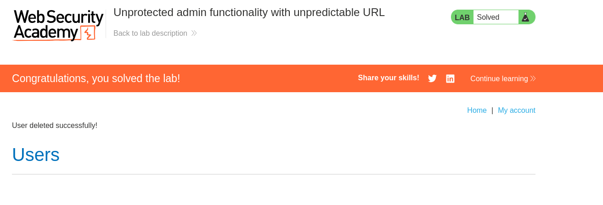

# Lab: Unprotected Admin Functionality with Unpredictable URL

## Objective

Find the hidden admin URL from the website's JavaScript and delete the user `carlos`.

---

## Tools Used

- Burp Suite Community Edition
- Mozilla Firefox
- PortSwigger Web Security Academy

---

## Steps Performed

### Step 1 - Open the Lab

**Description:**

- Opened the lab in Firefox.
- Checked the homepage.

**Screenshot:**



---

### Step 2 - View Page Source

**Description:**

- Right-clicked on the webpage.
- Clicked **View Page Source**.
- Found the JavaScript file.

**Screenshot:**


---

### Step 3 - Find the Hidden Admin URL

**Description:**

- Opened the JavaScript file.
- Found the hidden admin URL.
- Copied the URL.

Example:

```
/administrator-panel-xxxxx
```

**Screenshot:**



---

### Step 4 - Open the Admin Panel

**Description:**

- Pasted the hidden URL into the browser.
- Opened the admin panel.

**Screenshot:**



---

### Step 5 - Delete User Carlos

**Description:**

- Found the user **carlos**.
- Clicked **Delete**.
- The user was removed.

**Screenshot:**



---

### Step 6 - Lab Solved

**Description:**

- The lab showed **Solved**.
- Verified the attack was successful.

**Screenshot:**



---

## Vulnerability

The admin page was hidden using a random URL, but the URL was visible in the JavaScript source code. Anyone could find it and access the admin panel.

---

## Impact

- Attackers can find the hidden admin page.
- Unauthorized users can access admin features.
- Sensitive actions, such as deleting users, can be performed.

---

## Root Cause

The application exposed the hidden admin URL in client-side JavaScript and did not properly protect the admin page.

---

## Mitigation

- Check user permissions on the server.
- Do not store sensitive URLs in JavaScript.
- Use Role-Based Access Control (RBAC).
- Return **403 Forbidden** for unauthorized users.

---

## Key Learning

- Hidden URLs are not secure.
- JavaScript code can be viewed by anyone.
- Always enforce authorization on the server.
- Always inspect page source and JavaScript during web application testing.