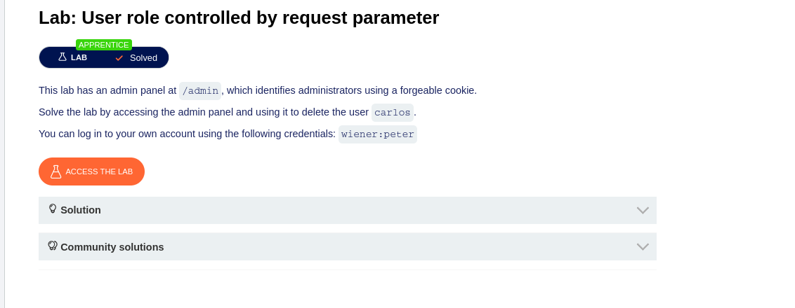
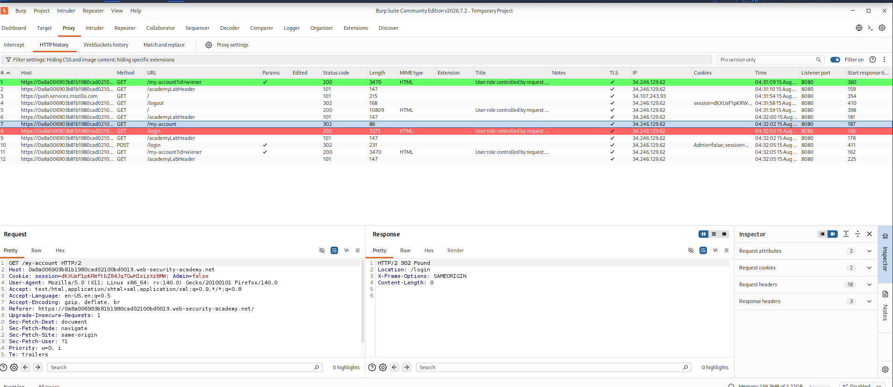
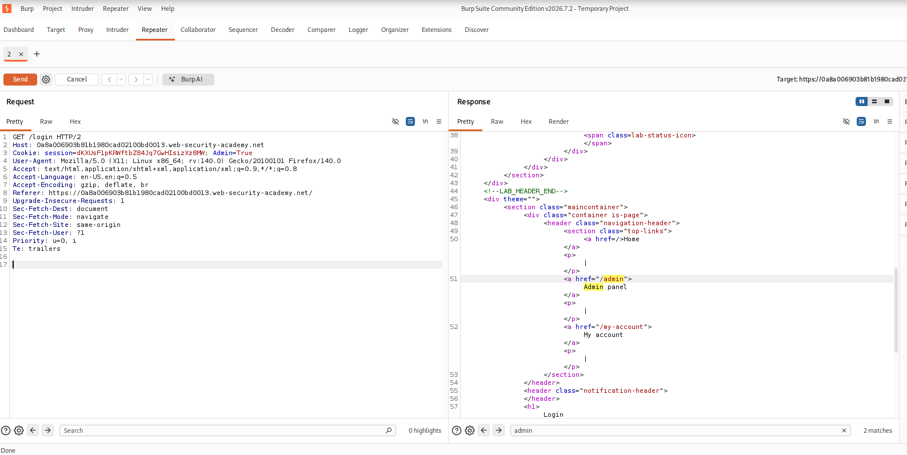
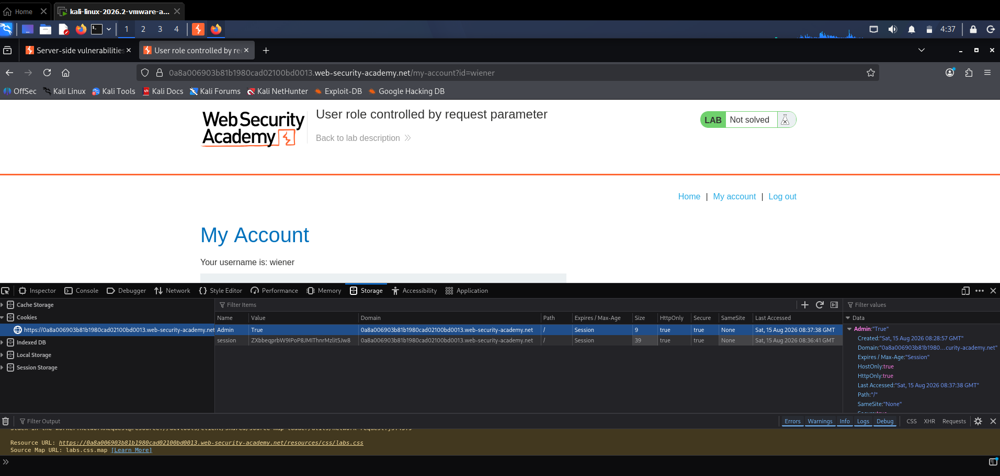
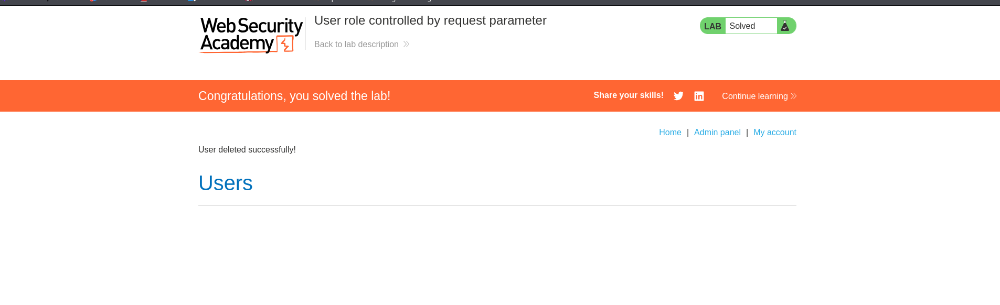

# Lab: User Role Controlled by Request Parameter

## Objective

Access the admin panel and delete the user `carlos`.

---

## Tools Used

- Burp Suite Community Edition
- Firefox
- PortSwigger Web Security Academy

---

## Steps Performed

### Step 1 - Open the Lab

Opened the lab and logged in with:

```text
wiener:peter
```

**Screenshot:**



---

### Step 2 - Check the Request

Opened **Burp Suite → Proxy → HTTP History**.

Selected the request for the account page and checked the cookie.

The cookie contained:

```text
Admin=false
```

**Screenshot:**



---

### Step 3 - Check the Admin Cookie

The `Admin` cookie was controlling whether the user was treated as an administrator.

The value was:

```text
Admin=false
```

**Screenshot:**



---

### Step 4 - Change the Cookie

Changed:

```text
Admin=false
```

to:

```text
Admin=True
```

Sent the request again.

The application then gave access to the admin functionality.

**Screenshot:**



---

### Step 5 - Delete Carlos

Opened the admin panel.

Found the user `carlos` and deleted the account.

The lab showed that the user was deleted successfully.

**Screenshot:**



---

## Vulnerability

The application trusted the `Admin` cookie to decide if the user was an administrator.

The cookie could be changed by the user from:

```text
Admin=false
```

to:

```text
Admin=True
```

This allowed a normal user to access the admin panel.

---

## Impact

- Normal users can get admin access.
- Admin functions can be accessed without proper permission.
- Users can be deleted by an unauthorized user.

---

## Root Cause

The application trusted a value controlled by the user for authorization.

---

## Mitigation

- Check admin permissions on the server.
- Do not trust client-side cookies for authorization.
- Use proper access control for admin functions.
- Return `403 Forbidden` when the user does not have permission.

---

## Key Learning

- Users can modify their own cookies.
- Client-side values should not control access.
- Authorization should be checked on the server.
- Burp Suite can be used to inspect and modify requests.