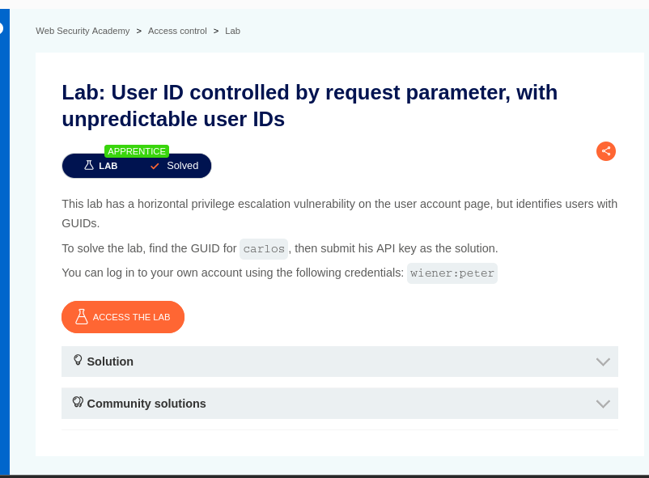
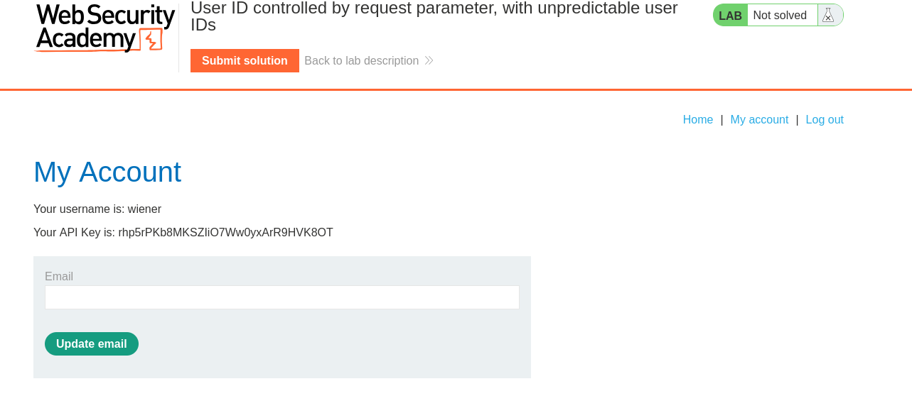

# Lab: User ID Controlled by Request Parameter, with Unpredictable User IDs

## Objective

Find the user ID of `carlos` and get his API key.

---

## Tools Used

- Burp Suite Community Edition
- Firefox
- PortSwigger Web Security Academy

---

## Steps Performed

### Step 1 - Open the Lab

Opened the lab in Firefox.

The lab gives the following login details:

`wiener:peter`

The goal was to find Carlos's GUID and submit his API key.

**Screenshot:**



---

### Step 2 - Open My Account

Logged in with the given credentials.

Opened **My Account** and checked my account details.

The page showed my username and API key.

**Screenshot:**



---

### Step 3 - Find Carlos's ID

Opened Burp Suite and checked the request.

The request used an `id` parameter:

```text
/my-account?id=...