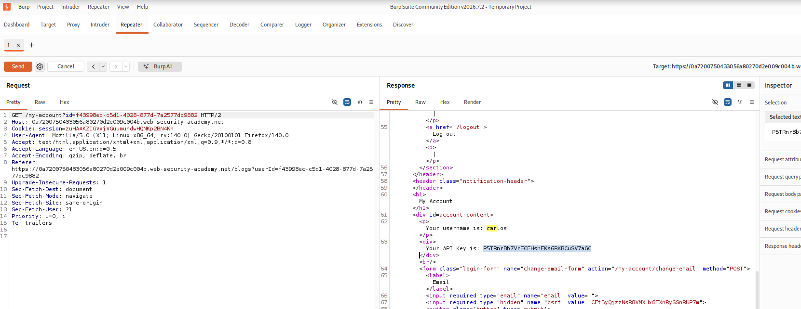
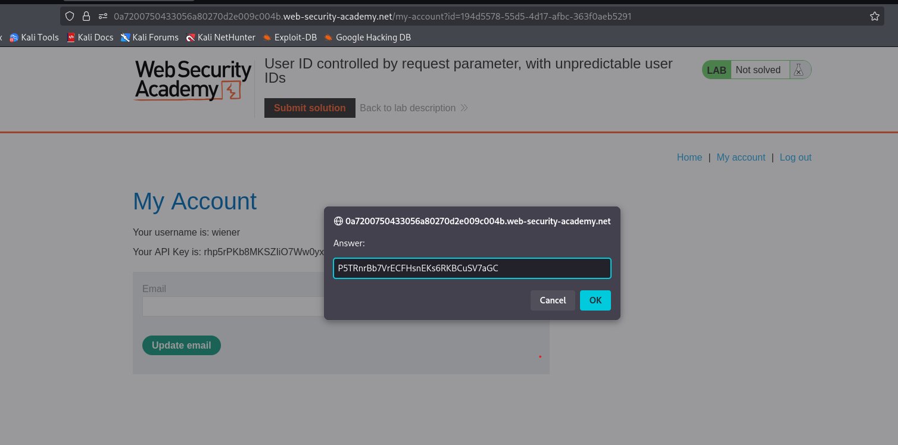
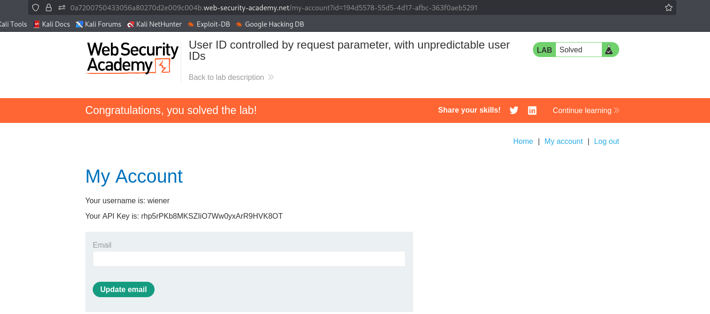

# Lab: User ID Controlled by Request Parameter, with Unpredictable User IDs

## Objective

Find the user ID of `carlos` and get his API key.

---

## Tools Used

- Burp Suite Community Edition
- Firefox
- PortSwigger Web Security Academy

---

## Steps Performed

### Step 1 - Open the Lab

Opened the lab in Firefox.

The lab provided these login details:

```text
wiener:peter
```

The goal was to find Carlos's GUID and submit his API key.

**Screenshot:**


---

### Step 2 - Open My Account

Logged in using the provided credentials.

Opened **My Account** and checked my account details.

The page showed my username and API key.

**Screenshot:**


---

### Step 3 - Find Carlos's ID

Opened Burp Suite and checked the request.

The request used an `id` parameter:

```text
/my-account?id=...
```

I changed the ID and checked the response.

The response showed:

```text
Your username is: carlos
Your API Key is: ...
```

This gave me Carlos's GUID and API key.

**Screenshot:**



---

### Step 4 - Submit Carlos's API Key

Copied Carlos's API key from the response.

Clicked **Submit solution** and entered the API key.

The solution was accepted.

**Screenshot:**



---

### Step 5 - Lab Solved

The lab displayed the **Solved** message.

The lab was completed successfully.

**Screenshot:**



---

## Vulnerability

The application used the `id` parameter to identify the user account.

By changing the ID, I was able to access Carlos's account information.

---

## Impact

- Another user's account information can be accessed.
- Sensitive information such as an API key can be exposed.
- An attacker may be able to access another user's data.

---

## Root Cause

The application did not properly check whether the logged-in user was allowed to access the requested account.

---

## Mitigation

- Check authorization for every account request.
- Do not rely only on unpredictable user IDs.
- Allow users to access only their own account.
- Perform authorization checks on the server.

---

## Key Learning

- Unpredictable IDs are not a security control.
- Changing an ID in a request can expose another user's data.
- Authorization must be checked on the server.
- Burp Suite can be used to test ID-based access control.