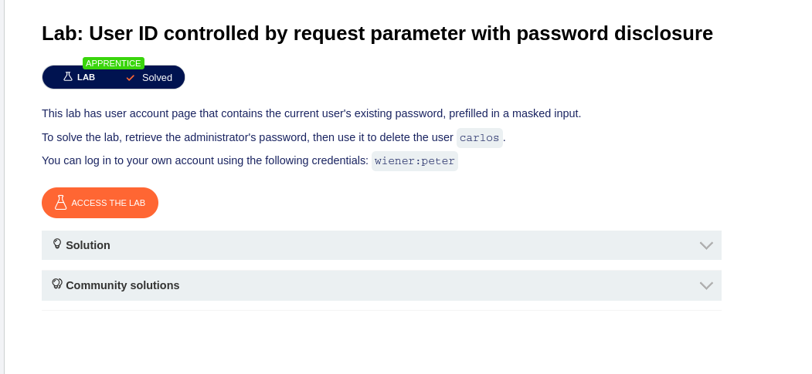
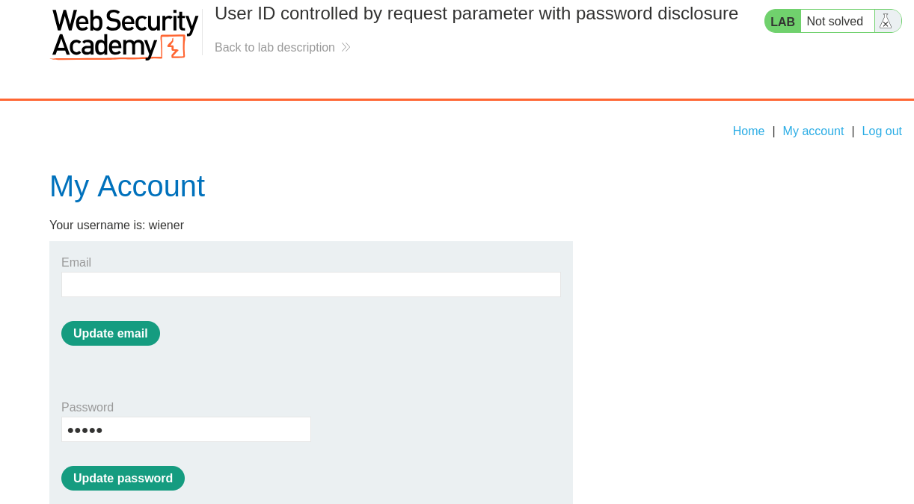
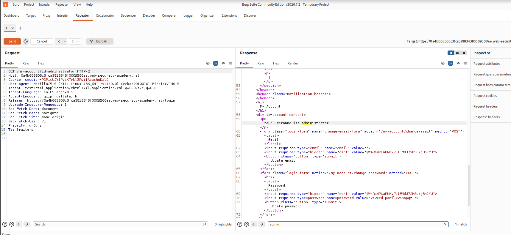
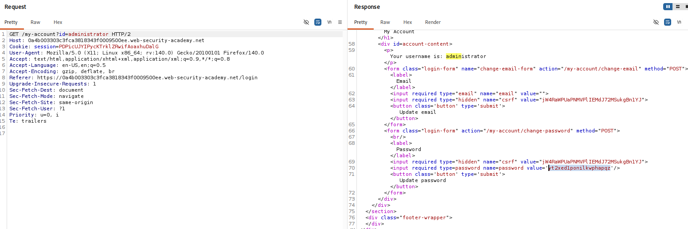
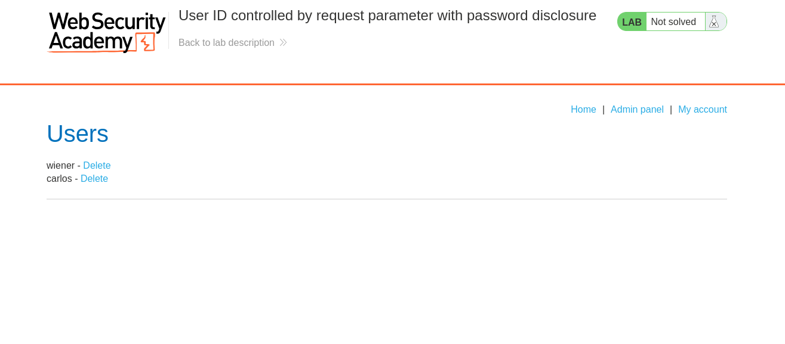
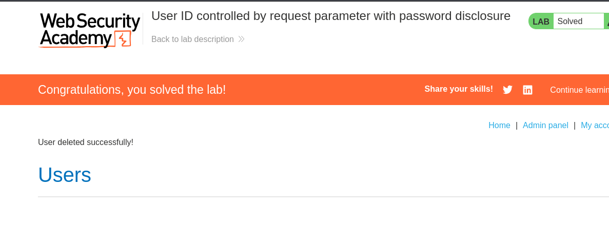

# Lab: User ID Controlled by Request Parameter with Password Disclosure

## Objective

Find the administrator's password and use it to delete the user `carlos`.

---

## Tools Used

- Burp Suite Community Edition
- Firefox
- PortSwigger Web Security Academy

---

## Steps Performed

### Step 1 - Open the Lab

Opened the PortSwigger Web Security Academy lab.

The lab provided these credentials:

```text
wiener:peter
```

The goal was to find the administrator's password and delete `carlos`.

**Screenshot:**



---

### Step 2 - Open My Account

Logged in as `wiener`.

Opened the **My Account** page.

The password field was already filled with the current user's password, but it was hidden.

**Screenshot:**



---

### Step 3 - Change the User ID

Opened Burp Suite Repeater.

Changed the `id` parameter in the request to:

```text
id=administrator
```

The response showed the administrator's account.

**Screenshot:**



---

### Step 4 - Find the Administrator Password

Checked the response in Burp Suite.

The administrator's password was visible in the HTML source of the password field.

**Screenshot:**



---

### Step 5 - Open the Admin Panel

Used the administrator's access to open the admin panel.

The panel showed the users `wiener` and `carlos`.

Clicked **Delete** for `carlos`.

**Screenshot:**



---

### Step 6 - Lab Solved

The user `carlos` was deleted successfully.

The lab displayed the **Solved** message.

**Screenshot:**



---

## Vulnerability

The application used the `id` parameter to load different user accounts.

Changing the ID to `administrator` allowed access to the administrator's account page.

The administrator's password was also exposed in the page source.

---

## Impact

- An attacker can access another user's account.
- Administrator credentials can be exposed.
- An attacker can gain administrator access.
- Admin actions such as deleting users can be performed.

---

## Root Cause

The application did not properly check whether the logged-in user was allowed to access another user's account.

It also exposed the existing password in the page source.

---

## Mitigation

- Check authorization for every account request.
- Do not allow users to access other accounts by changing an ID.
- Never expose passwords in HTML or page source.
- Store passwords securely using strong password hashing.
- Apply proper access control to administrator functions.

---

## Key Learning

- User IDs should not be trusted for authorization.
- Changing an `id` parameter can expose another user's data.
- Passwords should never be exposed in page source.
- Authorization must be checked on the server.
- Burp Suite can be used to test access control issues.